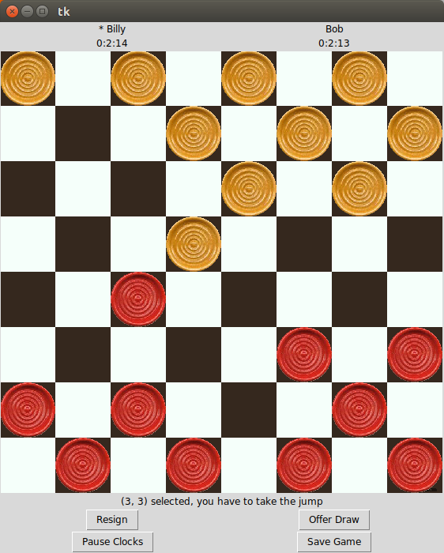

# Checkers #

This is a two-person Checkers app that I wrote in Python.

## Features ##

### Move Validation ###
The app enforces the standard rules for movement in checkers. You can only move your own pieces, you can't move your piece to an already occupied square, you can only move diagonally one place, and if a jump is available, you have to take it. It also detects when it's possible to make double jumps and when to king pieces.

### Timer ###
The app has a built in timer. This timer can be setup with a base period of time plus a bonus for each move made.

### Victory Conditions ###
It automatically determines winners and losers. For example, you lose when no moves are available to you. You win when all of your opponents' pieces have been taken off the field. You also lose if your time runs out or if you resign. You can also offer a draw on your turn which the other player can accept on his or her turn.

### Save/Resume game ###
It's possible to save the game and resume playing at a later date.

## Requirements ##

### Python 3 ###
    
    apt-get install python3

### Tkinter ###

    apt-get install python3-tk

## Run ##
    
    python3 checkers.py
